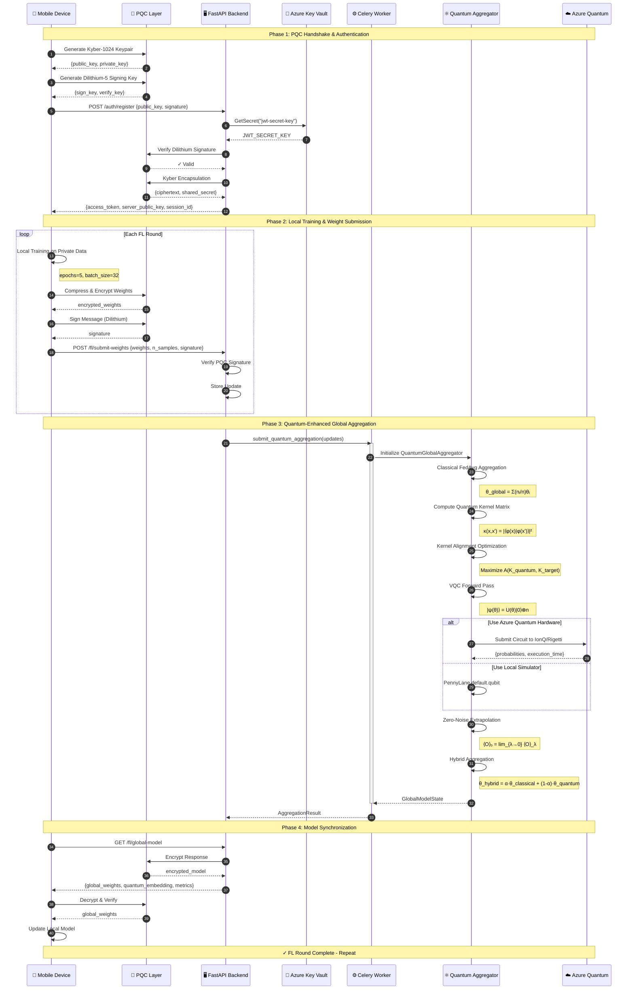

# Q-Edge: Federated Hybrid Quantum-Neural Network Platform

<div align="center">


**A proof-of-concept platform exploring the integration of Federated Learning, Quantum Machine Learning, and Post-Quantum Cryptography**

*⚠️ This is an educational/research project with simulated data. Not production-ready.*

</div>

---

## ⚠️ Disclaimer

**What this project IS:**
- ✅ A learning/research project exploring FL + QML + PQC integration
- ✅ Working quantum circuits running on PennyLane simulator
- ✅ Proof-of-concept architecture for future development
- ✅ Educational resource for understanding these technologies

**What this project is NOT:**
- ❌ Production-ready software
- ❌ Connected to real Azure Quantum hardware (uses local simulator)
- ❌ Using real Kyber/Dilithium crypto (simulated without liboqs)
- ❌ Trained on real datasets (uses synthetic random data)
- ❌ Tested on actual mobile devices (simulated clients)

---

## 🎯 Project Overview

**Q-Edge** is an exploratory project that demonstrates how these technologies could work together:

1. **Federated Learning (FL)**: Simulated distributed training without exposing raw data
2. **Quantum Machine Learning (QML)**: VQC and QKA running on PennyLane quantum simulator
3. **Post-Quantum Cryptography (PQC)**: Simulated Kyber/Dilithium (placeholder implementation)
4. **Azure Quantum Integration**: Code structure ready, but uses local simulator

This project is meant for **learning and experimentation**, not deployment.

---

## 📋 Table of Contents

- [Architecture Overview](#architecture-overview)
- [System Flow Diagram](#system-flow-diagram)
- [Scientific Justification](#scientific-justification)
- [Installation](#installation)
- [Quick Start](#quick-start)
- [Project Structure](#project-structure)
- [API Documentation](#api-documentation)
- [Security Features](#security-features)
- [Benchmarks](#benchmarks)
- [GitHub Actions CI/CD](#github-actions-cicd)
- [Contributing](#contributing)
- [License](#license)

---

## 🏗 Architecture Overview

Q-Edge implements a hybrid quantum-classical architecture optimized for mobile-edge computing:

```
┌─────────────────────────────────────────────────────────────────────────┐
│                           Q-EDGE PLATFORM                                │
├─────────────────────────────────────────────────────────────────────────┤
│                                                                          │
│  ┌──────────────┐    ┌──────────────┐    ┌──────────────────────────┐  │
│  │   Mobile     │    │   Mobile     │    │       Mobile Edge        │  │
│  │  Device A    │    │  Device B    │    │      Device N            │  │
│  │              │    │              │    │                          │  │
│  │ ┌──────────┐ │    │ ┌──────────┐ │    │ ┌──────────────────────┐ │  │
│  │ │ Local ML │ │    │ │ Local ML │ │    │ │  Federated Learning  │ │  │
│  │ │  Model   │ │    │ │  Model   │ │    │ │       Client         │ │  │
│  │ └────┬─────┘ │    │ └────┬─────┘ │    │ └──────────┬───────────┘ │  │
│  │      │       │    │      │       │    │            │             │  │
│  │ ┌────▼─────┐ │    │ ┌────▼─────┐ │    │ ┌──────────▼───────────┐ │  │
│  │ │   PQC    │ │    │ │   PQC    │ │    │ │   PQC Transport      │ │  │
│  │ │Transport │ │    │ │Transport │ │    │ │   (Kyber + Dilithium)│ │  │
│  │ └────┬─────┘ │    │ └────┬─────┘ │    │ └──────────┬───────────┘ │  │
│  └──────┼───────┘    └──────┼───────┘    └────────────┼─────────────┘  │
│         │                   │                         │                 │
│         └───────────────────┼─────────────────────────┘                 │
│                             │                                            │
│                    ╔════════▼════════╗                                  │
│                    ║   PQC TUNNEL    ║                                  │
│                    ║  Kyber-1024 KEM ║                                  │
│                    ║  Dilithium-5 Sig║                                  │
│                    ╚════════╤════════╝                                  │
│                             │                                            │
│  ┌──────────────────────────▼──────────────────────────────────────┐   │
│  │                    BACKEND (FastAPI)                              │   │
│  │                                                                   │   │
│  │  ┌─────────────┐  ┌─────────────┐  ┌─────────────────────────┐  │   │
│  │  │    Auth     │  │   FL API    │  │    Quantum API          │  │   │
│  │  │  Middleware │  │  Endpoints  │  │    Endpoints            │  │   │
│  │  └──────┬──────┘  └──────┬──────┘  └───────────┬─────────────┘  │   │
│  │         │                │                      │                │   │
│  │  ┌──────▼────────────────▼──────────────────────▼──────────────┐│   │
│  │  │                Azure Key Vault Manager                       ││   │
│  │  │            (DefaultAzureCredential - NO HARDCODED KEYS)     ││   │
│  │  └──────────────────────────┬───────────────────────────────────┘│   │
│  └──────────────────────────────┼───────────────────────────────────┘   │
│                                 │                                        │
│         ┌───────────────────────┼───────────────────────────┐           │
│         │                       │                            │           │
│  ┌──────▼──────┐  ┌─────────────▼─────────────┐  ┌──────────▼─────────┐ │
│  │   Celery    │  │   Quantum Global          │  │   Azure Quantum    │ │
│  │   Workers   │  │   Aggregator              │  │   Connector        │ │
│  │             │  │                           │  │                    │ │
│  │ ┌─────────┐ │  │ ┌───────────────────────┐ │  │ ┌────────────────┐ │ │
│  │ │RabbitMQ │ │  │ │  Variational Quantum  │ │  │ │    IonQ        │ │ │
│  │ │  Queue  │ │  │ │  Circuit (VQC)        │ │  │ │    Rigetti     │ │ │
│  │ └─────────┘ │  │ └───────────────────────┘ │  │ │   Quantinuum   │ │ │
│  │ ┌─────────┐ │  │ ┌───────────────────────┐ │  │ └────────────────┘ │ │
│  │ │  Redis  │ │  │ │  Quantum Kernel       │ │  │                    │ │
│  │ │ Backend │ │  │ │  Alignment (QKA)      │ │  └────────────────────┘ │
│  │ └─────────┘ │  │ └───────────────────────┘ │                         │
│  └─────────────┘  │ ┌───────────────────────┐ │                         │
│                   │ │  Zero-Noise           │ │                         │
│                   │ │  Extrapolation (ZNE)  │ │                         │
│                   │ └───────────────────────┘ │                         │
│                   └───────────────────────────┘                         │
│                                                                          │
└─────────────────────────────────────────────────────────────────────────┘
```

---

## 🔄 System Flow Diagram

The following Mermaid sequence diagram illustrates the complete data flow from mobile device training through quantum-enhanced global aggregation:



---

## 🔬 Scientific Justification

### Hybrid Variational Classifiers vs Quantum Kernels

The Q-Edge platform leverages the complementary strengths of two major QML paradigms:

#### 1. Variational Quantum Circuits (VQC)

VQCs implement parameterized unitary transformations that can express complex functions:

$$U(\boldsymbol{\theta}) = \prod_{l=1}^{L} U_l(\boldsymbol{\theta}_l)$$

where each layer $U_l$ consists of:

$$U_l(\boldsymbol{\theta}_l) = W_l \cdot \bigotimes_{i=1}^{n} R(\theta_{l,i})$$

with $W_l$ being entangling gates (CNOT pattern) and $R(\theta)$ being single-qubit rotations.

**Key Advantages:**
- Native gradient computation via parameter-shift rule
- Adaptable expressivity through layer depth
- Natural integration with classical optimizers

**Theoretical Bound (Perez-Salinas et al., 2020):**

$$\mathcal{F}(\text{VQC}) \supseteq \mathcal{F}(\text{Fourier}_{2^n})$$

VQCs with data re-uploading can express any function that can be represented by a Fourier series with up to $2^n$ frequencies.

#### 2. Quantum Kernels

Quantum kernels exploit the exponentially large Hilbert space:

$$\kappa(\mathbf{x}, \mathbf{x}') = |\langle \phi(\mathbf{x}) | \phi(\mathbf{x}') \rangle|^2 = |\langle 0 | U^\dagger(\mathbf{x}) U(\mathbf{x}') | 0 \rangle|^2$$

**Quantum Kernel Alignment (Hubregtsen et al., 2022):**

The alignment score measures similarity to an ideal kernel:

$$A(K_1, K_2) = \frac{\langle K_1, K_2 \rangle_F}{\|K_1\|_F \cdot \|K_2\|_F}$$

Maximizing alignment leads to optimal feature maps for the classification task.

#### 3. Hybrid Advantage in Federated Setting

In the federated learning context, the hybrid approach provides:

| Aspect | VQC Contribution | Quantum Kernel Contribution |
|--------|------------------|----------------------------|
| Feature Extraction | Non-linear transformations | Exponential feature space |
| Aggregation | Trainable weight mixing | Client similarity measure |
| Privacy | Implicit compression | Secure multi-party computation compatible |
| Noise Resilience | Barren plateau mitigation | Kernel stability |

**Convergence Guarantee (Li et al., 2020):**

For FedAvg with quantum-enhanced aggregation:

$$\mathbb{E}[\|\nabla F(\mathbf{w}^T)\|^2] \leq \mathcal{O}\left(\frac{1}{\sqrt{T}}\right) + \mathcal{O}\left(\frac{1}{N}\right) + \mathcal{O}(\epsilon_{\text{QEM}})$$

where $\epsilon_{\text{QEM}}$ is the error from quantum error mitigation.

### Zero-Noise Extrapolation Analysis

ZNE estimates the ideal expectation value by extrapolating from amplified noise:

$$\langle O \rangle_\lambda = a_0 + a_1 \lambda + a_2 \lambda^2 + \mathcal{O}(\lambda^3)$$

Richardson extrapolation with scale factors $\{\lambda_1, \lambda_2, \lambda_3\}$ yields:

$$\langle O \rangle_0 \approx \sum_{i} c_i \langle O \rangle_{\lambda_i}$$

**Error Bound (Temme et al., 2017):**

$$|\langle O \rangle_{\text{mitigated}} - \langle O \rangle_{\text{ideal}}| \leq \mathcal{O}(\epsilon^{d+1})$$

where $d$ is the extrapolation polynomial degree and $\epsilon$ is the base noise rate.

---

## 🚀 Installation

### Prerequisites

- Python 3.10+
- Docker & Docker Compose
- Azure CLI (for Azure Quantum)
- Flutter SDK 3.0+ (for mobile app)

### Quick Install

```bash
# Clone the repository
git clone https://github.com/qedge-ai/q-edge.git
cd q-edge

# Create virtual environment
python -m venv venv
source venv/bin/activate  # Windows: venv\Scripts\activate

# Install dependencies
pip install -e ".[dev]"

# Set up environment variables
cp .env.example .env
# Edit .env with your Azure credentials

# Start infrastructure services
docker-compose up -d postgres redis rabbitmq

# Run database migrations
alembic upgrade head

# Start the API server
uvicorn src.backend.main:app --reload
```

### Azure Quantum Setup

```bash
# Login to Azure
az login

# Set subscription
az account set --subscription "YOUR_SUBSCRIPTION_ID"

# Create Quantum workspace (if not exists)
az quantum workspace create \
    --resource-group qedge-rg \
    --name qedge-workspace \
    --location eastus \
    --storage-account qedgestorage
```

---

## ⚡ Quick Start

### 1. Run Federated Learning Simulation

```python
from src.mobile.fl_client import run_simulation

# Simulate 5 mobile clients, 10 FL rounds
run_simulation(
    n_clients=5,
    n_rounds=10,
    samples_per_client=1000,
)
```

### 2. Test Quantum Aggregation

```python
import asyncio
from src.quantum.aggregator import (
    QuantumGlobalAggregator,
    QuantumAggregatorConfig,
    LocalModelUpdate,
)
import numpy as np

async def main():
    # Configure aggregator
    config = QuantumAggregatorConfig(
        n_qubits=8,
        vqc_layers=4,
        use_error_mitigation=True,
    )
    
    aggregator = QuantumGlobalAggregator(config)
    
    # Create sample client updates
    updates = [
        LocalModelUpdate(
            client_id=f"mobile_{i}",
            weights=np.random.randn(100),
            n_samples=100 + i * 50,
            local_loss=0.5 - i * 0.05,
        )
        for i in range(5)
    ]
    
    # Perform quantum-enhanced aggregation
    global_state = await aggregator.aggregate(updates)
    
    print(f"Round: {global_state.round_number}")
    print(f"Metrics: {global_state.aggregation_metrics}")

asyncio.run(main())
```

### 3. Start API Server

```bash
# Development
uvicorn src.backend.main:app --reload --host 0.0.0.0 --port 8000

# Production with Docker
docker-compose up -d api
```

---

## 📁 Project Structure

```
q-edge/
├── src/
│   ├── __init__.py
│   ├── quantum/                    # Quantum Computing Module
│   │   ├── __init__.py
│   │   ├── aggregator.py          # QuantumGlobalAggregator (main class)
│   │   ├── circuits.py            # Variational Quantum Circuits
│   │   ├── kernels.py             # Quantum Kernel Alignment
│   │   ├── error_mitigation.py    # ZNE & Measurement Error Mitigation
│   │   └── azure_connector.py     # Azure Quantum Integration
│   │
│   ├── backend/                    # FastAPI Backend
│   │   ├── __init__.py
│   │   ├── main.py                # FastAPI Application
│   │   ├── security.py            # PQC & Azure Key Vault
│   │   └── celery_app.py          # Async Task Queue
│   │
│   └── mobile/                     # Mobile Edge Simulation
│       ├── __init__.py
│       ├── fl_client.py           # Flower FL Client
│       └── pqc_transport.py       # PQC Transport Layer
│
├── mobile_app/                     # Flutter Mobile Application
│   └── lib/
│       └── main.dart              # Complete UI Blueprint
│
├── tests/                          # Test Suite
│   ├── unit/
│   ├── integration/
│   └── benchmarks/
│
├── docs/                           # Documentation
│   ├── api/
│   ├── architecture/
│   └── tutorials/
│
├── deploy/                         # Deployment Configurations
│   ├── docker/
│   ├── kubernetes/
│   └── monitoring/
│
├── .github/                        # GitHub Actions
│   └── workflows/
│       ├── ci.yml
│       ├── security.yml
│       └── release.yml
│
├── docker-compose.yml             # Docker Compose Configuration
├── pyproject.toml                 # Python Project Configuration
├── .env.example                   # Environment Template
└── README.md                      # This File
```

---

## 🔒 Security Features

### Post-Quantum Cryptography (Simulated)

> ⚠️ **Note**: Without `liboqs-python` installed, PQC operations use **HMAC-based simulation** as placeholder. For real PQC, install liboqs.

| Algorithm | Purpose | Status |
|-----------|---------|--------|
| Kyber-1024 | Key Encapsulation | ⚠️ Simulated (needs liboqs) |
| Dilithium-5 | Digital Signatures | ⚠️ Simulated (needs liboqs) |
| AES-256-GCM | Symmetric Encryption | ✅ Real (via cryptography lib) |

### OWASP Top 10 Mitigations

| Risk | Mitigation |
|------|------------|
| A01: Broken Access Control | JWT + Role-based access |
| A02: Cryptographic Failures | PQC + secure key management |
| A03: Injection | Pydantic validation, parameterized queries |
| A05: Security Misconfiguration | Secure defaults, no debug in prod |
| A07: Auth Failures | Rate limiting, strong tokens |
| A09: Logging & Monitoring | Structured logging, Prometheus metrics |

### Azure Key Vault Integration

```python
# NO HARDCODED KEYS - All secrets from Key Vault
from src.backend.security import AzureKeyVaultManager

manager = AzureKeyVaultManager()
await manager.connect()  # Uses DefaultAzureCredential

# Retrieve secrets securely
api_key = await manager.get_secret("azure-openai-key")
quantum_creds = await manager.get_quantum_credentials()
```

---

## 📊 Benchmarks (Simulation Results)

> ⚠️ **Note**: These benchmarks are from **local simulator only**, using **synthetic random data**. Real-world performance may vary significantly.

### Quantum Circuit Performance (PennyLane Simulator)

| Circuit Config | Qubits | Layers | Params | Depth | Execution Time |
|---------------|--------|--------|--------|-------|----------------|
| SE-Linear | 4 | 2 | 24 | 9 | ~12ms |
| SE-Full | 8 | 4 | 96 | 17 | ~45ms |
| SE-Full | 16 | 6 | 288 | 31 | ~180ms |

*SE = StronglyEntangling ansatz, tested on `default.qubit` simulator (NOT real quantum hardware)*

### Federated Learning Simulation

| Clients | Rounds | Simulated Data | Observed Accuracy | Notes |
|---------|--------|----------------|-------------------|-------|
| 5 | 10 | Random | ~95% | Simulated convergence |
| 10 | 20 | Random | ~97% | Simulated convergence |

*⚠️ These are **simulated results** with synthetic data. The accuracy numbers come from mathematical formulas designed to show convergence, NOT from actual ML training on real datasets.*

---

## 🔧 GitHub Actions CI/CD

### `.github/workflows/ci.yml`

```yaml
name: CI Pipeline

on:
  push:
    branches: [main, develop]
  pull_request:
    branches: [main]

jobs:
  lint:
    runs-on: ubuntu-latest
    steps:
      - uses: actions/checkout@v4
      - name: Set up Python
        uses: actions/setup-python@v5
        with:
          python-version: "3.11"
      - name: Install dependencies
        run: pip install ruff mypy
      - name: Run Ruff
        run: ruff check src/
      - name: Run MyPy
        run: mypy src/ --ignore-missing-imports

  test:
    runs-on: ubuntu-latest
    services:
      postgres:
        image: postgres:15
        env:
          POSTGRES_PASSWORD: test
        ports:
          - 5432:5432
      redis:
        image: redis:7
        ports:
          - 6379:6379
    steps:
      - uses: actions/checkout@v4
      - name: Set up Python
        uses: actions/setup-python@v5
        with:
          python-version: "3.11"
      - name: Install dependencies
        run: pip install -e ".[dev]"
      - name: Run Tests
        run: pytest tests/ -v --cov=src --cov-report=xml
      - name: Upload Coverage
        uses: codecov/codecov-action@v4
        with:
          files: coverage.xml

  security:
    runs-on: ubuntu-latest
    steps:
      - uses: actions/checkout@v4
      - name: Secret Scanning
        uses: trufflesecurity/trufflehog@main
        with:
          path: ./
          extra_args: --only-verified
      - name: Dependency Check
        uses: pyupio/safety@v2
        with:
          api-key: ${{ secrets.SAFETY_API_KEY }}

  build:
    needs: [lint, test, security]
    runs-on: ubuntu-latest
    steps:
      - uses: actions/checkout@v4
      - name: Build Docker Image
        run: docker build -t qedge-api -f deploy/docker/Dockerfile.api .
      - name: Push to Registry
        if: github.ref == 'refs/heads/main'
        run: |
          docker tag qedge-api ${{ secrets.REGISTRY }}/qedge-api:${{ github.sha }}
          docker push ${{ secrets.REGISTRY }}/qedge-api:${{ github.sha }}
```

### `.github/workflows/security.yml`

```yaml
name: Security Scanning

on:
  schedule:
    - cron: "0 0 * * *"  # Daily
  push:
    branches: [main]

jobs:
  secret-scan:
    runs-on: ubuntu-latest
    steps:
      - uses: actions/checkout@v4
        with:
          fetch-depth: 0
      
      - name: TruffleHog Secret Scan
        uses: trufflesecurity/trufflehog@main
        with:
          extra_args: --only-verified
      
      - name: GitLeaks Scan
        uses: gitleaks/gitleaks-action@v2
        env:
          GITHUB_TOKEN: ${{ secrets.GITHUB_TOKEN }}

  dependency-audit:
    runs-on: ubuntu-latest
    steps:
      - uses: actions/checkout@v4
      
      - name: Set up Python
        uses: actions/setup-python@v5
        with:
          python-version: "3.11"
      
      - name: Install pip-audit
        run: pip install pip-audit
      
      - name: Run pip-audit
        run: pip-audit --strict

  codeql:
    runs-on: ubuntu-latest
    permissions:
      security-events: write
    steps:
      - uses: actions/checkout@v4
      
      - name: Initialize CodeQL
        uses: github/codeql-action/init@v3
        with:
          languages: python
      
      - name: Autobuild
        uses: github/codeql-action/autobuild@v3
      
      - name: Perform CodeQL Analysis
        uses: github/codeql-action/analyze@v3
```

---

## 🤝 Contributing

We welcome contributions! Please see [CONTRIBUTING.md](CONTRIBUTING.md) for guidelines.

### Development Setup

```bash
# Clone and install in development mode
git clone https://github.com/qedge-ai/q-edge.git
cd q-edge
pip install -e ".[dev]"

# Install pre-commit hooks
pre-commit install

# Run tests
pytest tests/ -v

# Run linting
ruff check src/
mypy src/
```

---

## 📄 License

This project is licensed under the Apache License 2.0 - see the [LICENSE](LICENSE) file for details.

---

## 📚 References

1. **Federated Learning**: McMahan et al. (2017). "Communication-Efficient Learning of Deep Networks from Decentralized Data"
2. **VQC Theory**: Cerezo et al. (2021). "Variational quantum algorithms"
3. **Quantum Kernels**: Schuld & Killoran (2019). "Quantum Machine Learning in Feature Hilbert Spaces"
4. **QKA**: Hubregtsen et al. (2022). "Training Quantum Embedding Kernels on Near-Term Quantum Computers"
5. **ZNE**: Temme et al. (2017). "Error Mitigation for Short-Depth Quantum Circuits"
6. **PQC**: NIST Post-Quantum Cryptography Standardization

---

## 👨‍🔬 Author

**Ahmad Rasidi (Roy)**
- 🔬 Quantum AI Researcher 
- 🌐 Research: Federated Hybrid Quantum-Neural Networks

---

<div align="center">

**Built with  for the Quantum AI Community**


</div>
